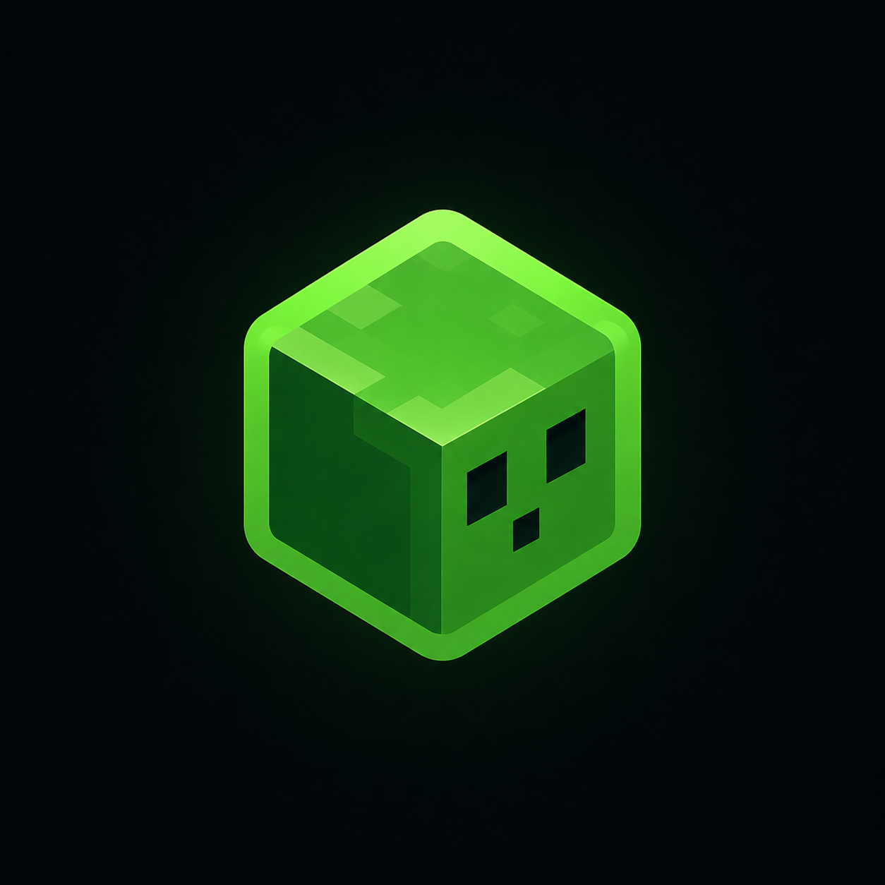

<p align="center">
  
</p>

<h1 align="center">SlimeLauncher</h1>

<p align="center">
  <b>The cozy Minecraft launcher — fast, slime-themed, like TLauncher but better.</b><br>
  Launch any version from <code>c0.0.11</code> to <code>26.2</code> with mods in one click.
</p>

<p align="center">
  
  
  
  
</p>

<p align="center">
  <a href="#-quick-start">Quick Start</a> •
  <a href="#-features">Features</a> •
  <a href="#-skins-like-tlauncher">Skins</a> •
  <a href="DOCUMENTATION.md">Full Docs</a> •
  <a href="SKIN_CATALOG_GUIDE.md">Skin Catalog Guide</a> •
  <a href="CHANGELOG.md">Changelog</a>
</p>

---

### ✨ Why SlimeLauncher?

- **Offline + Microsoft** — up to 8 accounts, switch instantly. CaSe matters (`Sigmultra452 ≠ sigmultra452`).
- **Any version** — vanilla, fabric, forge, neoforge, quilt, snapshots.
- **Mods / Maps / Modpacks** — 1-click from Modrinth & CurseForge, `Update all`.
- **Skins & Capes like TLauncher** — out of the box via `ely.by` + local `SkinServer`.
- **Friends on LAN** — see who is `In menu / LAN world` on the same Wi-Fi.
- **Network** — play over internet without port-forward (like Radmin VPN, inside the launcher).
- **Own server** — `Paper/Vanilla` in 1 click + UPnP.
- **Nice extras** — HD skins, world backups, recording (`F8`/`F9`), Discord Rich Presence.

### 🚀 Quick Start

**1. Download**
Get `SlimeLauncher Setup 1.18.4.exe` from [**Releases**](https://github.com/Mishaadevv/SlimeLauncher/releases) → run → pick folder.

**2. Create account**
`Accounts` → `Add offline` → nickname with **exact CaSe** that your server expects. Or `Link Microsoft account` (needs owned Java Edition).

**3. Create instance**
`Instances` → `Create Instance` → `1.21.11` + `fabric` → `Play`. Missing Java? Launcher downloads the correct one automatically (`Java 8 → 25`).

**4. Install mods**
`Mods` → choose your instance → search `sodium`, `jei` → `Install`.

### 🎨 Skins like TLauncher

**Quick (SlimeLauncher peers):** `Skins` → `Offline skin` → `Upload skin` (`PNG 64×64…1024×1024`). Visible to friends who also use SlimeLauncher.

**Any server:** register at **[ely.by](https://ely.by)** with **the same nickname (CaSe!)** → upload skin/cape → `SlimeLauncher 1.18+` pulls it from `skinsystem.ely.by` automatically. Check [`SKIN_CATALOG_GUIDE.md`](SKIN_CATALOG_GUIDE.md) for details.

### 🤝 Friends & Network

- **Friends:** `Add friend` by nick → see `Online · LAN world on port N` on same Wi-Fi.
- **Network:** `Create Network` → share key → friend `Join Network` → host `Open to LAN` in Minecraft → world appears in `Multiplayer` even across cities.

### 📦 Build from source

```bash
npm install
npm run build
npx electron-builder --win --publish never
# → release/SlimeLauncher Setup 1.18.4.exe
